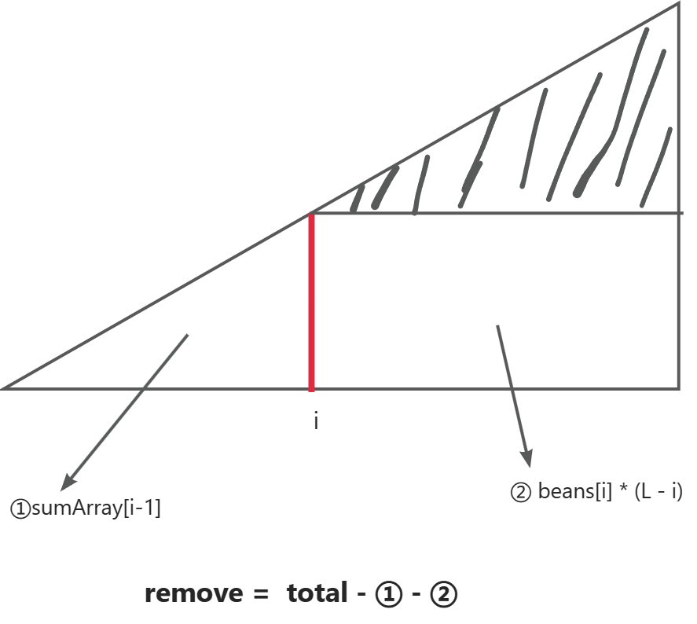

# [2171. 拿出最少数目的魔法豆](https://leetcode.cn/problems/removing-minimum-number-of-magic-beans/description/)

> Problem: [2171. 拿出最少数目的魔法豆](https://leetcode.cn/problems/removing-minimum-number-of-magic-beans/description/)

[TOC]

## 思路/解题方法

最开始想到的就是画了一个柱状图，需要我切一刀，然后使得每个柱子都一样高，切的位置要尽可能靠上。

如何去切这一刀，可能需要排序，这样可以更方便的进行计算比较。

最差的情况就是把每个柱子都切了，这样每个都是0，非零的豆子输都相等，我们在此基础上找最好的情况。

我们对整个数组进行一次遍历，依次以当前为基准计算需要移除的豆子数目，如果比之前的小，就更新最小值。

当前要移除的为 = 之前已经移除的和 + 以当前为准的情况下要移除的豆子数目

以当前为准的情况下要移除的豆子数目 = 总和 - 之前的和 - 当前的数目 * 后面的长度

可参考下图：

<!-- https://www.yuque.com/chends-ink/oe49b1/qbvci70bgxiopg0x?singleDoc#%20%E3%80%8Aleetcode-2171%E3%80%8B -->


## 复杂度

- 时间复杂度: $O(nlogn)$ 排序的时间复杂度
- 空间复杂度: $O(n)$ 一个额外的数组记录前面移除掉的豆子数目之和


## Code

```JavaScript []
/**
 * @param {number[]} beans
 * @return {number}
 */
var minimumRemoval = function (beans) {
    if (beans.length <= 1) {
        return 0;
    }
    beans.sort((a, b) => a - b);
    const total = beans.reduce((acc, b) => acc + b, 0);
    const length = beans.length;
    let result = total;
    let sumArray = new Array(length + 1).fill(0);
    let remove = 0;

    // 以当前为基准 比较每种情况的大小
    for (let i = 0; i < length; i++) {
        sumArray[i + 1] = sumArray[i] + beans[i]; // 下标往后偏移一位 可不用单独处理第一位
        // 之前的和 + 以当前为准要移除的
        // 以当前为准的要移除的 = 总和 - 之前的和 - 当前的数目 * 后面的长度
        remove =
            sumArray[i] +
            (total - sumArray[i + 1] - (length - i - 1) * beans[i]);
        result = Math.min(result, remove);
    }
    return result;
};
```

```TypeScript []
function minimumRemoval(beans: number[]): number {
    if (beans.length <= 1) {
        return 0;
    }
    beans.sort((a, b) => a - b);
    const total = beans.reduce((acc, b) => acc + b, 0);
    const length = beans.length;
    let result = total;
    let sumArray = new Array(length + 1).fill(0);
    let remove = 0;

    // 以当前为基准 比较每种情况的大小
    for (let i = 0; i < length; i++) {
        sumArray[i + 1] = sumArray[i] + beans[i]; // 下标往后偏移一位 可不用单独处理第一位
        // 之前的和 + 以当前为准要移除的
        // 以当前为准的要移除的 = 总和 - 之前的和 - 当前的数目 * 后面的长度
        remove =
            sumArray[i] +
            (total - sumArray[i + 1] - (length - i - 1) * beans[i]);
        result = Math.min(result, remove);
    }
    return result;
};
```

```Go []
func minimumRemoval(beans []int) int64 {
	length := len(beans)
	if length <= 1 {
		return 0
	}
	sort.Ints(beans)
	var total int64 = 0
	for _, bean := range beans {
		total += int64(bean)
	}
	prevSumArr := make([]int64, length+1)

	var remove int64 = 0
	var result int64 = total

	for i, bean := range beans {
		prevSumArr[i+1] = prevSumArr[i] + int64(bean)
		remove = prevSumArr[i] + (total - prevSumArr[i+1] - int64(length-i-1)*int64(bean))
		result = min(result, remove)
	}
	return result
}
func min(a, b int64) int64 {
	if a < b {
		return a
	}
	return b
}
```

```Python []
class Solution:
    def minimumRemoval(self, beans: list[int]) -> int:
        length = len(beans)
        if length <= 1:
            return 0
        beans.sort()
        prefix_sum = [0] * length
        total_beans = sum(beans)
        min_removal = float("inf")

        for i in range(length):
            # python 中 prefix_sum[-1] 是最后一位，初始化为0，无须单独处理第一位
            prefix_sum[i] = prefix_sum[i - 1] + beans[i]
            beans_to_remove = prefix_sum[i - 1] + (
                total_beans - prefix_sum[i] - (length - i - 1) * beans[i]
            )
            min_removal = min(min_removal, beans_to_remove)
        return min_removal
```
